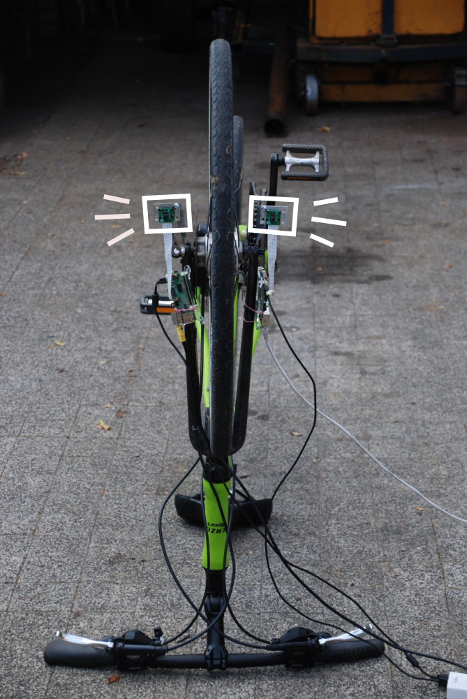
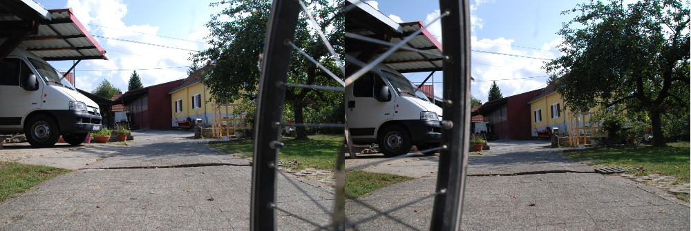

# What a bike sees

> What if you put a camera on each side of the front wheel and stitched them?

By stitching the two image, it should be possible to "see through" the front wheel. A point of view not otherwise possible without stitching.

# Draft result

Link: https://www.youtube.com/watch?v=Nla2GkQ25Xk

Note: in this video seam calculation is left to automatic (using *GraphCut*). By choosing the seam in a smarter way, it should be possible to hide the wheels almost entirely. 
